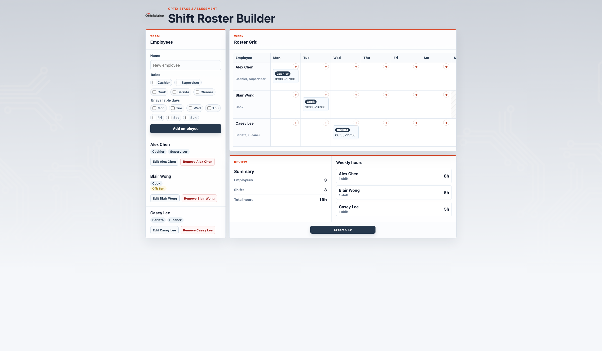

# Shift Roster Builder

A weekly staff scheduling web app for the Optix Solutions Stage 2 take-home assignment.

[](https://youtu.be/a7XEsMy2kfI)

**Demo video:** [YouTube walkthrough](https://youtu.be/a7XEsMy2kfI)

## Quick Start

```bash
npm install
npm run dev
```

The Vite dev server prints the local URL after startup. No backend, database, account setup, or environment variables are required.

## Features

- Add, edit, and remove employees.
- Assign employees one or more roles, such as Cashier, Supervisor, Cook, Barista, or Cleaner.
- Mark employee unavailable days, such as "Alex cannot work Mondays".
- Add, edit, remove, and drag-and-drop shifts across employees and weekdays.
- Block invalid assignments before they are saved:
  - overlapping shifts for the same employee on the same day
  - more than 5 consecutive scheduled days
  - unavailable-day assignments
  - invalid time ranges and invalid employee-role pairings
- Show weekly roster assignments in a grid by employee and day.
- Show weekly summary totals and per-employee hours.
- Export the roster as CSV with employee, role, day, start, end, and hours columns.
- Use an Optix-branded Light Ops dashboard UI with the official logo and circuit-board background.

## Scripts

```bash
npm run dev
npm run build
npm run preview
npm test
```

## Technical Approach

The app is built with React and Vite. State is kept in memory with a custom `useRoster` hook backed by `useReducer`, because the domain is small and action-based roster updates are easier to test and review than scattered component state.

No third-party scheduling or roster libraries are used. Time parsing, hour calculation, conflict detection, weekly summaries, CSV formatting, and validation rules are implemented in local utility modules.

## Data Model

```js
Employee = {
  id: string,
  name: string,
  roles: string[],
  unavailableDays: number[] // 0 = Monday, 6 = Sunday
}

Shift = {
  id: string,
  employeeId: string,
  role: string,
  day: 0 | 1 | 2 | 3 | 4 | 5 | 6,
  startTime: "HH:MM",
  endTime: "HH:MM"
}
```

Shifts reference employees by ID so employee edits do not duplicate roster data. A shift stores its assigned role because employees can have multiple roles and each shift still needs one clear duty.

## Conflict And Availability Rules

- Time ranges use half-open intervals: `09:00-12:00` and `12:00-17:00` are adjacent, not overlapping.
- Overlap checks only compare shifts for the same employee on the same day.
- Exactly 5 consecutive scheduled days is allowed; 6 or 7 consecutive scheduled days is blocked.
- Availability is checked before conflict detection so unavailable-day errors stay specific.
- Drag-and-drop uses the same reducer validation as manual shift add/edit flows.

## UI/UX Decisions

The final visual direction is a Light Ops Dashboard for Optix Solutions. The official logo and circuit-board background are used for brand fit, while the main workspace remains light and readable for dense scheduling work.

The desktop layout follows the manager workflow:

- Employees panel on the left for setup and edits.
- Roster Grid at the top right as the main scheduling canvas.
- Review panel at the bottom right with Summary on the left, Weekly hours on the right, and Export CSV centered as the final action.

Low-value UI noise was removed during polish, including count pills, the long feature subtitle, the phase-status label, conflict detail text, and conflict counts. Invalid actions are still blocked with inline errors at the point of action.

## AI Tools And Review

AI tools were used as implementation and review assistants, not as unchecked output:

- Codex / ChatGPT: planning, implementation, UI refinements, documentation, test verification, GitHub workflow.
- Product Design workflow: Optix-branded Light Ops redesign direction and layout polish.
- Claude Code / mimo-v2.5-pro: earlier implementation support, functionality testing, and documentation review.
- HyperFrames project workflow with local Whisper and FFmpeg: subtitled demo video preparation.

Human review and AI-assisted review were used throughout. Generated suggestions were checked against the assessment brief, the existing codebase, tests, browser behavior, and user testing feedback before being kept.

## Verification

Automated checks run during the final stages:

```bash
npm test
npm run build
```

Final verified coverage includes utility logic, reducer behavior, employee UI, roster grid interactions, summary/export behavior, availability validation, drag-and-drop validation, and App header rendering.

Manual QA covered:

- add/edit/remove employee
- add/edit/remove shift
- drag-and-drop shift reassignment
- overlapping-shift validation
- more-than-5-consecutive-days validation
- unavailable-day validation
- weekly hours summary
- CSV export
- desktop and mobile layout checks

## Known Limitations

- Data is in memory only and resets on refresh.
- Same-day shifts only; overnight shifts are intentionally out of scope.
- Availability is day-level only, not time-slot based.
- CSV export focuses on scheduled shifts and does not include availability notes.
- Touch-device drag-and-drop support is not included.

## Development Documentation

Stage-by-stage documentation lives in [docs/](./docs/). Each phase records thought process, design decisions, AI tools used, verification, known limitations, and GitHub status.
